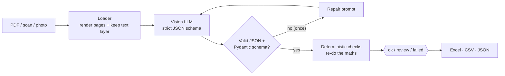

# 🧾 Doc2Sheet

**Turn invoices and receipts (PDFs, scans, phone photos) into clean, validated spreadsheet rows.**

A vision LLM reads the document, Pydantic enforces the schema, and deterministic checks
re-do the arithmetic — so a misread total gets flagged for review instead of silently
landing in your books.

[](https://github.com/yesyesyanyan/doc2sheet/actions/workflows/ci.yml)
[](https://huggingface.co/spaces/yesyesyanyan/doc2sheet)


**▶ Try it:** [huggingface.co/spaces/yesyesyanyan/doc2sheet](https://huggingface.co/spaces/yesyesyanyan/doc2sheet) — click
*“Try the sample documents”*, no upload needed.

<!-- After deploying, record a short GIF of the demo and add it here:  -->

---

## The problem

Small businesses, bookkeepers and ops teams still retype invoices into spreadsheets.
Classic OCR gives you a wall of text, not fields. Asking an LLM gets you fields — but LLMs
occasionally misread a digit or "helpfully" invent a total, and nobody notices until
month-end.

Doc2Sheet treats the model as a **fast but fallible reader** and puts guard-rails around it.

## Features

- **Any input** — digital PDFs (the text layer is used too), scanned PDFs, JPG/PNG photos, multi-page TIFFs
- **Structured output** — vendor, customer, invoice number, dates, currency, subtotal, discount, charges, tax, total and every line item
- **Validation you can trust** — line maths, items vs subtotal, `subtotal − discount + charges + tax = total`, date and currency sanity. Each document ends up **ok**, **review** or **failed**
- **Self-repair** — if the model returns malformed JSON, it gets one automatic chance to fix it
- **Handles real-world formatting** — `1.234,50 €`, `CHF 1'234.50`, `(12.00)`, `12 August 2026`, `01.09.2026`; ambiguous dates like `05/03/2026` are refused rather than guessed
- **Exports** — a reviewer-friendly Excel workbook (Documents / Line items / Issues, colour-coded), CSV (Excel-safe UTF-8) and JSON
- **Provider-agnostic** — any OpenAI-compatible API: Hugging Face Inference Providers, OpenAI, Gemini, OpenRouter, Groq… or **fully local and private with Ollama**
- **Batch processing** — web UI, CLI for whole folders, and a callable API

## How it works



| Check | Level | Example |
|---|---|---|
| `total_mismatch` | error | subtotal 383.40 + tax 76.68 = 460.08, but the document says 469.08 |
| `missing_total` | error | no total found |
| `line_math` | warning | 2 × 150.00 = 300.00, but the line says 310.00 |
| `items_vs_subtotal` | warning | lines add up to 2,585.00, subtotal is 2,575.00 |
| `due_before_issue`, `future_date` | warning | date sanity |
| `missing_vendor`, `missing_date`, `missing_currency`, `invalid_currency` | warning | incomplete data |
| `negative_total`, `not_an_invoice`, `pages_truncated` | warning | unusual documents |

Tax-inclusive pricing (common on EU receipts) is recognised and not flagged.

The [`samples/`](samples) folder has four **fictional** documents covering the usual cases: a digital PDF with
European number formatting, a phone photo of a café receipt, a scanned image-only PDF, and an invoice
with a **deliberately wrong total** so you can watch the checks catch it.

## Quick start

Requires Python 3.10+.

```bash
git clone https://github.com/yesyesyanyan/doc2sheet.git
cd doc2sheet
python -m venv .venv
# Windows: .venv\Scripts\activate    macOS/Linux: source .venv/bin/activate
pip install -e ".[app,dev]"
cp .env.example .env        # Windows: copy .env.example .env
```

Put a Hugging Face token in `.env` (create one at
[huggingface.co/settings/tokens](https://huggingface.co/settings/tokens/new?tokenType=fineGrained) with the
*Make calls to Inference Providers* permission — the free tier is enough to try it).

**Web UI**

```bash
python app.py        # open http://127.0.0.1:7860
```

**Command line** — process a whole folder into one workbook:

```bash
python -m doc2sheet samples/ -o results.xlsx --json results.json
```

Example output:

```
Processing 4 file(s) with google/gemma-4-31B-it ...
[1/4] OK      invoice_pixel_pine_eur.pdf  Pixel & Pine Design Studio SARL | EUR 3,090.00 | 4.1s
[2/4] REVIEW  invoice_kestrel_total_error.pdf  Kestrel Logistics Ltd | GBP 469.08 | 3.8s  (1 issue(s))
...
```

The exit code is `1` if any file failed, so it drops straight into scripts, cron jobs or n8n.

### Choosing a model / provider

Everything goes through one OpenAI-compatible client, so switching provider is two settings:

| Provider | `DOC2SHEET_BASE_URL` | Key | Model |
|---|---|---|---|
| Hugging Face (default) | `https://router.huggingface.co/v1` | `HF_TOKEN` | `google/gemma-4-31B-it`, `Qwen/Qwen3-VL-8B-Instruct`, … |
| Ollama (local, offline, private) | `http://localhost:11434/v1` | – | a vision model you pulled, e.g. `qwen3-vl:2b` — see *Small local models* below |
| OpenAI | `https://api.openai.com/v1` | `DOC2SHEET_API_KEY` | any vision-capable model |
| Google Gemini | `https://generativelanguage.googleapis.com/v1beta/openai` | `DOC2SHEET_API_KEY` | any Gemini model |
| OpenRouter / Groq / vLLM / LM Studio | their OpenAI-compatible URL | as required | any vision model |

**Small local models:** thinking-only models (the default `qwen3-vl` tags) can spend the whole answer budget
"thinking" and return nothing, and Ollama's default context window (4096 tokens) is short. Prefer an `-instruct`
(non-thinking) vision model, send smaller page images with `DOC2SHEET_MAX_IMAGE_SIDE=1024`, and/or raise Ollama's
context with `OLLAMA_CONTEXT_LENGTH=8192`. `DOC2SHEET_REASONING_EFFORT=none` switches thinking off for models that
support it.

Structured-output support varies between providers, so the default `DOC2SHEET_JSON_MODE=auto` tries a strict
JSON schema first and falls back (`json_object` → plain prompt) if the provider rejects it — the Pydantic
validation and repair step still apply either way.

### Use it from code

```python
from doc2sheet import extract_document
from doc2sheet.config import Settings
from doc2sheet.llm import OpenAICompatibleClient

llm = OpenAICompatibleClient.from_settings(Settings.from_env())
result = extract_document("invoice.pdf", llm)
print(result.status, result.document.total, [i.message for i in result.issues])
```

Or call the hosted demo as an API with [`gradio_client`](https://www.gradio.app/guides/getting-started-with-the-python-client):

```python
from gradio_client import Client, handle_file

client = Client("yesyesyanyan/doc2sheet")
summary, documents, line_items, issues, data, files = client.predict(
    files=[handle_file("invoice.pdf")], model="google/gemma-4-31B-it", api_key="", base_url="",
    api_name="/extract",
)
```

## Deploy your own Space

```bash
pip install huggingface_hub
python scripts/deploy_space.py --space <your-hf-username>/doc2sheet --inference-token hf_xxx
```

`--inference-token` becomes the Space secret `HF_TOKEN` (give it only the *Inference Providers* permission).
To deploy automatically after every green CI run on `main`, add a repository **variable** `HF_SPACE` and a
repository **secret** `HF_TOKEN` (write access) — see [`.github/workflows/ci.yml`](.github/workflows/ci.yml).

## Design notes

- **The model is not trusted with arithmetic.** It is told to copy values as printed and use `null` when unsure;
  the maths is re-done in `Decimal` by [`checks.py`](doc2sheet/checks.py).
- **Public-demo safety.** The Space's own token is only ever sent to the Space's configured endpoint (so nobody can
  point the app at their server and harvest it), the endpoint is locked, and visitors without their own key are
  limited to a curated list of models and 5 files per run. See [`service.py`](doc2sheet/service.py) and its tests.
- **Prompt-injection aware.** Document text is passed as data, and the system prompt says so explicitly.
- **Concurrency.** Model calls run in parallel; PDF rendering is serialised because PDFium is not thread-safe
  (a test that processes a batch concurrently caught this).
- **No SDK lock-in.** A small `httpx` client with retries, `Retry-After` support and readable errors
  replaces vendor SDKs.

## Project structure

```
doc2sheet/
├── app.py                  # Gradio web UI (also the Hugging Face Space entry point)
├── doc2sheet/
│   ├── loaders.py          # PDF/image → page images + text layer
│   ├── prompts.py          # system prompt, strict JSON schema, reply parsing
│   ├── llm.py              # OpenAI-compatible client with fallbacks & retries
│   ├── schema.py           # Pydantic models + lenient money/date parsing
│   ├── checks.py           # deterministic validation
│   ├── extractor.py        # the pipeline (+ repair loop, batch processing)
│   ├── export.py           # Excel / CSV / JSON writers
│   ├── service.py          # UI-agnostic glue & public-demo rules
│   └── cli.py              # command line interface
├── samples/                # fictional test documents (+ scripts/make_samples.py)
├── scripts/deploy_space.py # publish to Hugging Face Spaces
├── space/README.md         # Space configuration
└── tests/                  # pytest suite — no network or API key needed
```

## Tests

```bash
pytest          # 90+ tests, runs offline in about a second
ruff check .
```

The LLM is replaced by a fake in tests; HTTP behaviour (retries, fallbacks, error messages) is tested against
`httpx.MockTransport`.

## Limitations & roadmap

- Only the first 3 pages of a PDF are sent by default (`DOC2SHEET_MAX_PAGES`) to keep cost predictable.
- Handwritten receipts and very low-resolution photos are hit-and-miss, as with any vision model.
- Ideas: per-vendor field mapping, duplicate-invoice detection, Google Sheets / Airtable / QuickBooks export,
  an email-inbox watcher, confidence scoring by comparing two models.

## Need something like this?

I build small, reliable AI automations — document pipelines, lead routing, reporting bots.
Open an issue or reach out via my [GitHub profile](https://github.com/yesyesyanyan).

## License

[MIT](LICENSE). Sample documents are fictional and generated by [`scripts/make_samples.py`](scripts/make_samples.py).
